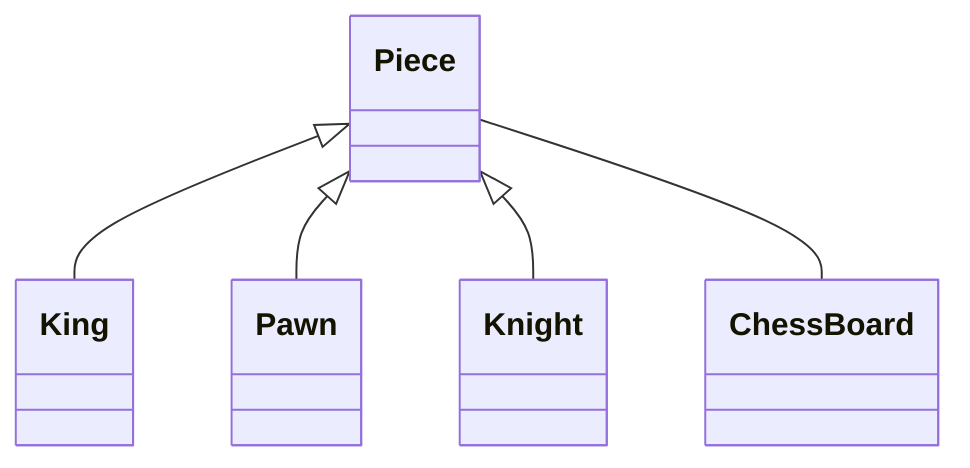
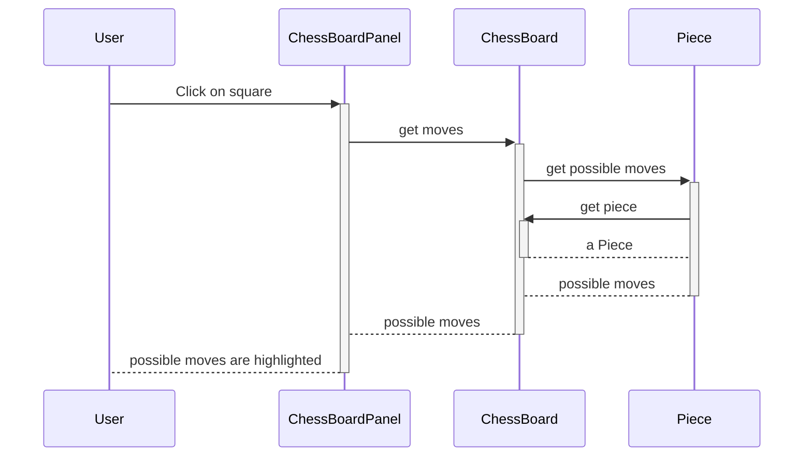

## Possible Classes
aka "find the nouns"
* ChessBoard
* ChessBoardPanel
* Piece
  * King
  * Knight
  * Pawn
* Player
* PeasantRevoltChess

## Notes
* A chess board stores 64 pieces, with null meaning empty
* A chess board panel stores a board as 
  an instance variable, which is set when created.

## One Attempt at Behavior
